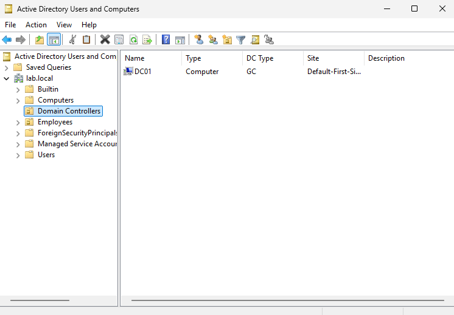

# Active Directory Lab

Active Directory homelab built on AWS EC2 using Windows Server, PowerShell, and Active Directory Domain Services (AD DS).

This project simulates a small business Active Directory environment where users, organizational units, security groups, workstations, and Group Policy are managed using standard system administration practices.

---

# Key Skills

- Windows Server Administration
- Active Directory Domain Services (AD DS)
- Organizational Units (OUs)
- Security Groups
- Group Policy Objects (GPO)
- User and Computer Management
- AWS EC2
- PowerShell
- DNS Configuration
- Remote Desktop Protocol (RDP)
- IT Documentation

---

# Technologies Used

- AWS EC2
- Windows Server
- Active Directory Domain Services (AD DS)
- Active Directory Users and Computers
- Group Policy Management
- PowerShell
- Remote Desktop Protocol (RDP)
- GitHub Documentation

---

# Project Objectives

The goal of this project was to build hands-on experience with Windows Server administration and Active Directory management.

Objectives completed:

- Deploy a Windows Server instance in AWS EC2
- Configure Windows Server as an Active Directory Domain Controller
- Create and manage an Active Directory domain
- Create Organizational Units (OUs)
- Create and manage security groups
- Create and manage user accounts
- Assign users to security groups
- Join a workstation to the Active Directory domain
- Create and apply Group Policy Objects (GPOs)
- Verify Group Policy deployment
- Perform common help desk administration tasks
- Document administrative tasks using ticket-style documentation

---

# Environment Setup

## Infrastructure

Cloud Provider:
```
AWS EC2
```

Operating System:
```
Windows Server
```

Server Role:
```
Active Directory Domain Controller
```

Domain:
```
lab.local
```

---

# PowerShell Commands Used

The following PowerShell commands were used during the setup process:

```powershell
Install-WindowsFeature AD-Domain-Services -IncludeManagementTools

Install-ADDSForest -DomainName "lab.local"
```

These commands installed Active Directory Domain Services and promoted the Windows Server instance to a Domain Controller.

---

# Active Directory Structure

The Active Directory environment was organized using Organizational Units to separate users and resources.

Example structure:

```
lab.local

├── Employees
│
│   ├── IT
│   │
│   ├── HR
│   │
│   ├── Sales
│   │
│   └── Accounting
│
├── Security Groups
│
└── Workstations
```

---

# Completed Tasks

## Active Directory Configuration

Completed:

* Created Windows Server EC2 instance  
* Connected to server using Remote Desktop Protocol (RDP)  
* Installed Active Directory Domain Services  
* Promoted server to Domain Controller  
* Created lab.local domain  
* Joined a Windows workstation to the Active Directory domain  
* Created a Workstations Organizational Unit  
* Created and applied a Group Policy Object (GPO)  
* Verified Group Policy deployment using gpresult  

---

# Organizational Unit Management

Created Organizational Units to organize users and resources:

- IT
- HR
- Sales
- Accounting
- Workstations

Organizational Units were used to separate users and computers based on department and improve Active Directory organization.

---

# User Management

Created Active Directory user accounts and organized them into appropriate departments.

Tasks completed:

- Created user accounts
- Assigned users to Organizational Units
- Configured account settings
- Managed user memberships

---

# Security Group Management

Created Active Directory security groups:

- IT-Admins
- HR-Users
- Sales-Users
- Accounting-Users
- HelpDesk

Group configuration:

- Group Scope: Global
- Group Type: Security

Users were assigned to security groups based on department responsibilities.

---

# Domain-Joined Workstation

A second Windows EC2 instance was deployed to simulate an employee workstation.

Tasks completed:

- Configured workstation DNS settings to use the Domain Controller
- Verified communication between workstation and Domain Controller
- Joined workstation to the `lab.local` domain
- Verified the computer object appeared in Active Directory
- Moved the workstation into the Workstations Organizational Unit

Example:


---

# Group Policy Management

A Group Policy Object (GPO) was created to demonstrate centralized computer management.

Tasks completed:

- Created a Workstation Security Policy GPO
- Linked the GPO to the Workstations Organizational Unit
- Applied computer configuration settings
- Updated Group Policy using:

```powershell
gpupdate /force
```

- Verified deployment using:

```powershell
gpresult /r
```

---

# Help Desk Ticket Documentation

The `tickets` folder contains simulated IT support requests documenting common Active Directory administration tasks.

Completed tickets:

| Ticket | Description |
|---|---|
| Ticket #001 | Create Active Directory security groups |
| Ticket #002 | Create user accounts |
| Ticket #003 | Assign users to security groups |
| Ticket #004 | Remove temporary security groups |
| Ticket #005 | Reset user passwords |
| Ticket #006 | Disable user accounts |
| Ticket #007 | Join workstation to Active Directory domain |
| Ticket #008 | Create and apply Group Policy |

These tickets demonstrate documentation practices used in IT support environments.

---

# Screenshots

Screenshots documenting the project can be found in the `screenshots` folder.

Included examples:

- Active Directory organizational structure
- Organizational Units
- User accounts
- Security groups
- Group memberships
- Domain joined workstation
- Group Policy configuration
- Account management tasks

Example:



---

# Repository Structure

```
Active-Directory-Lab

├── README.md
│
├── screenshots
│   ├── Active Directory screenshots
│   
├── tickets
│   ├── ticket-001-create-groups.md
│   ├── ticket-002-create-user-accounts.md
│   ├── ticket-003-assign-group-membership.md
│   ├── ticket-004-remove-test-group.md
│   ├── ticket-005-password-reset.md
│   ├── ticket-006-disable-user-account.md
│   ├── ticket-007-join-workstation-to-active-directory-domain.md
│   └── ticket-008-create-and-apply-group-policy.md
```

---

# Skills Demonstrated

Through this project I practiced:

- Windows Server administration
- Active Directory administration
- Domain Controller configuration
- User lifecycle management
- Computer lifecycle management
- Security group management
- Organizational Unit design
- Group Policy management
- DNS configuration
- PowerShell administration
- Remote Desktop administration
- IT documentation practices
- Basic troubleshooting workflows

---

# Lessons Learned

Through this project I gained hands-on experience with:

- Deploying and managing Windows Server in AWS
- Understanding Active Directory domain structure
- Managing users, computers, and permissions
- Configuring DNS for Active Directory communication
- Applying Group Policy in a domain environment
- Performing common IT support tasks
- Documenting administrative changes
- Troubleshooting Windows Server configurations

This project helped build foundational skills for system administration and IT support roles.

---

# Future Improvements

Potential additions to expand this lab:

- Implement shared folders and NTFS permissions
- Create and manage Group Policy Preferences
- Deploy software through Group Policy
- Configure roaming profiles or folder redirection
- Automate user creation with PowerShell scripts
- Add a second Domain Controller for redundancy
- Configure additional AWS resources to simulate a larger environment
- Add additional Windows Server roles
